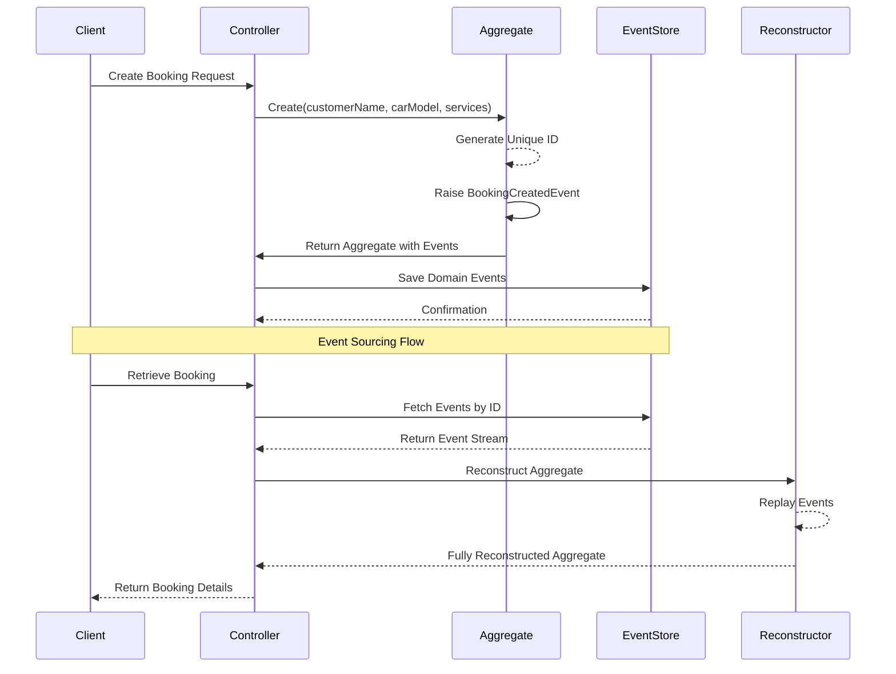

# Car Garage Booking - Event Sourcing and CQRS Example

## Project Overview

This is a demonstration of Event Sourcing and Command Query Responsibility Segregation (CQRS) principles using .NET 8, MongoDB, and Domain-Driven Design (DDD) techniques.

## Badges

[](https://dotnet.microsoft.com/)
[](https://www.mongodb.com/)
[](LICENSE)
[](https://github.com/yourusername/your-repo)

## Architecture Overview

### Event Sourcing
Event Sourcing is a design pattern where the state of an application is determined by a sequence of events. Instead of storing the current state, we store a series of events that describe how the state changed over time.

### CQRS (Command Query Responsibility Segregation)
CQRS separates read and write operations for a data store. In this implementation, we focus on the event sourcing aspect of the pattern.

## Key Components

### Domain Layer
- **Aggregates**: Encapsulate business logic and state changes
- **Domain Events**: Represent state changes in the system
- **Value Objects**: Represent immutable, conceptual whole objects

### Infrastructure Layer
- **Event Store**: Manages persistence of domain events
- **MongoDB Integration**: Provides event storage mechanism

## Key Concepts Demonstrated

1. **Event Sourcing**
   - Every state change is captured as an event
   - Ability to reconstruct aggregate state by replaying events

2. **Domain-Driven Design**
   - Rich domain model
   - Encapsulation of business logic within aggregates



## Getting Started

### Prerequisites
- .NET 8 SDK
- Docker
- MongoDB

### Installation

1. Clone the repository
```bash
git clone https://github.com/yourusername/car-garage-booking.git
```
2. Start MongoDB using Docker
   
```bash
docker run -d --name car-garage-mongodb \
    -p 27017:27017 \
    -e MONGO_INITDB_DATABASE=CarGarageBookingDb \
    mongo:latest
```

1. Run the application

```bash
dotnet run
```

## API Endpoints

### Create a Booking

```bash
curl -X POST http://localhost:5111/api/carbooking \
     -H "Content-Type: application/json" \
     -d '{
         "customerName": "John Doe",
         "carModel": "Toyota Camry",
         "services": [0, 1]
     }'
```

### Retrieve a Booking

```bash
curl http://localhost:5111/api/carbooking/{booking-id}
```

## Technology Stack

- Language: C# .NET 8
- Database: MongoDB
- Architectural Patterns:
  - Event Sourcing
  - CQRS
  - Domain-Driven Design

## Learning Resources

- Event Sourcing Pattern
- CQRS Pattern
- Domain-Driven Design

## Contributing

Fork the repository  
Create your feature branch (git checkout -b feature/AmazingFeature)  
Commit your changes (git commit -m 'Add some AmazingFeature')  
Push to the branch (git push origin feature/AmazingFeature)  
Open a Pull Request

## License
Distributed under the MIT License. See LICENSE for more information.

## Contact
Your Name - tonyjoanes@outlook.com
Project Link: https://github.com/tonyjoanes/cqrs-car-garage-booking